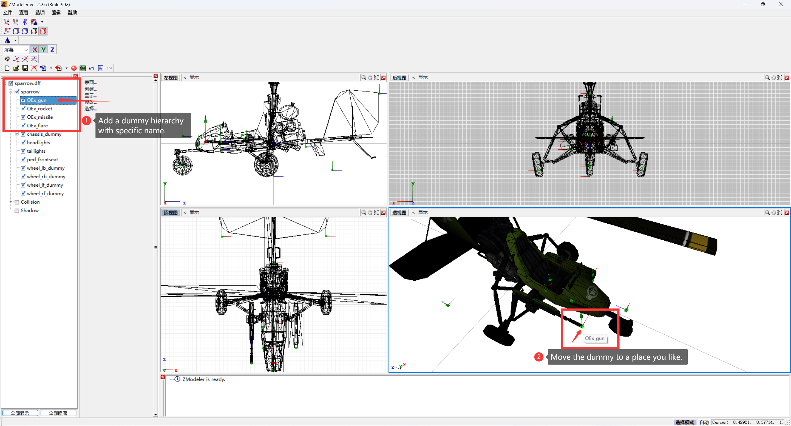
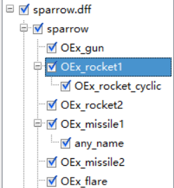

# OrdnanceEx

[English](./README.md) | [中文](./docs/README.md)

## Introduction
OrdnanceEx is a plugin built for GTA:SA(1.0US) to provide a customizable ordnance system for all flying vehicles in the game. You can easily add in-game support for machine guns, unguided missiles, heat-seeking missiles, and flares to your vehicle while creating models (such as when you are using ZModeler 2).

## License
The project is licensed under the MIT license. Please respect the work of others.

## Build
To build this project you need:  
- `plugin-sdk development environment`  
- `cmake 3.5`  
- `Compiler that supports C++17`  
- `visual studio build tools`

> After cloning this project, note the Settings for plugin-sdk and output directory in CMakeLists.txt.

Then build it using cmake:
``` 
cd OrdnanceEx 

cmake -S . -B .\build -A Win32

cmake --build .\build --config release
```

## How to use
### For the model:

1. Open your model file using the modeling software (.dff).
2. Add a dummy with a **specific name (listed later)** to the model hierarchy.

3. Save and export the dff file.
4. Replace the model into the game.

The plugin determines whether to give the function by detecting whether there is a hierarchy of specific names in the model, **so make sure that the dummy name matches the entry in the list below!**

| Dummy name | Function | Key |
| --- | --- | --- |
| OEx_gun | Machine gun | Helicopter: Secondary Fire (Usually left Ctrl)<br>Plane: Horn (Usually CapsLock) |
| OEx_rocket | Unguided Missile | Helicopter: Fire (Usually left Alt)<br>Plane: Secondary Fire (Usually left Ctrl) |
| OEx_missile | Heat-seeking missile | Helicopter: Handbrake + Secondary Fire (Usually Space + Ctrl)<br>Plane: Handbrake + Secondary Fire (Usually Space + Left Ctrl) |
| OEx_flare | Flare | Helicopter: Horn (Usually CapsLock)<br>Plane: Fire (Usually left Alt) |

In addition, the plugin also supports the function of cyclic switching launch position. The method of use is to add a child dummy hierarchy under the **first** missile dummy hierarchy, **with any name**. So pay attention to your hierarchy.  
This function will select one launch position at a time in order to launch unguided missiles in all dummies with the word `OEx_rocket` in the name or heat-seeking missiles in all dummies with the word `OEx_missile` in the name.  
_To ensure best rendering, try not to have any dummy hierarchy with the same name._  


### For installation:

Place the .asi file into the game directory or scripts folder after installing the asi loader.

### For in-game:

When you are driving a vehicle with the modified model, press the corresponding key in the list above and note whether the vehicle type is helicopter or plane.

## Issues
If you encounter any problems please open an issuse and explain there, I will check and reply regularly.

## Thanks and Credits:
[Plugin-SDK](https://github.com/DK22Pac/plugin-sdk) -DK22Pac  
[re3](https://github.com/halpz/re3) -halpz  
[gta-reversed-modern](https://github.com/gta-reversed/gta-reversed-modern) -All contributors  
[VehFuncs](https://github.com/JuniorDjjr/VehFuncs/) -JuniorDjjr

@Gray_Wolf(2772707686@qq.com) - Ideas and testing  
[@XLiu666233](https://github.com/XLiu666233)(135586225@qq.com) - Testing