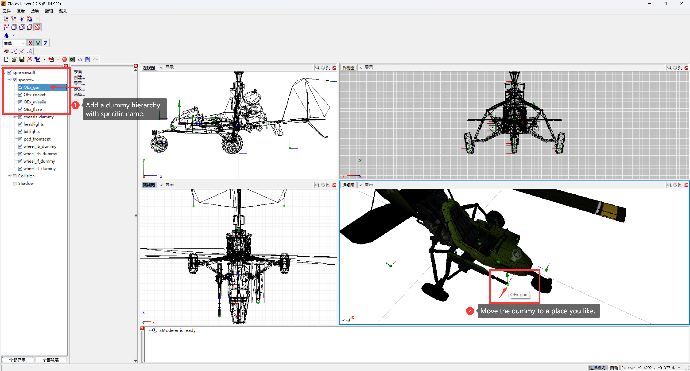

# OrdnanceEx

[English](../README.md) | [中文](./README.md)

## 说明
OrdnanceEx 是一个为GTA:SA（1.0US）构建的插件，旨在为游戏内所有飞行载具提供机载武器系统支持。 你可以在制作模型时（例如在Zmodeler 2中）便捷地为你的mod添加游戏内支持的机炮、导弹、热追踪导弹、热诱弹功能。

## 许可证
本项目奉行MIT开源许可证。请尊重他人的工作。

## 构建
为构建本项目，你需要：  
- `plugin-sdk 开发环境`  
- `cmake 3.5`  
- `支持C++17的编译器`  
- `visual studio 构建工具`

> 在克隆本项目后，请注意CMakeLists.txt中有关plugin-sdk的环境设置和插件输出目录。

之后使用cmake进行构建：
``` 
cd OrdnanceEx 

cmake -S . -B .\build -A Win32

cmake --build .\build --config release
```

## 使用方法
### 对于模型:

1. 在建模软件中打开你的模型文件 (.dff格式)。
2. 为模型添加一个拥有**特殊名称（稍后列出）** 的虚点层级。

3. 保存并导出.dff模型文件。
4. 把模型替换进游戏。

插件通过检测模型中是否有合法名称的虚点层级来决定是否向该载具提供对应功能支持，因此请确保虚点名称符合下表条目。

| 虚点名称 | 功能 | 键位 |
| --- | --- | --- |
| OEx_gun | 机炮 | 旋翼: 次开火键 （通常是左Ctrl）<br>固定翼: 鸣笛键 （通常是大写锁定键） |
| OEx_rocket | 无制导导弹 | 旋翼: 主开火键 （通常是左Alt）<br>固定翼: 次开火键 （通常是左Ctrl） |
| OEx_missile | 热追踪导弹 | 旋翼: 手刹 + 次开火键 （通常是空格+左Ctrl）<br>固定翼: 手刹 + 次开火键 （通常是空格+左Ctrl） |
| OEx_flare | 热诱弹 | 旋翼: 鸣笛键 （通常是大写锁定键）<br>固定翼: 主开火键 （通常是左Alt） |
| OEx_disable | 禁用原始机载武器系统 | 无 |

此外插件还支持两种导弹循环切换发射口的功能。使用方法为在**第一个**相应导弹虚点层级下添加一个子虚点层级，**名称任意**；因此注意你的层级分配。  
此功能将会在所有名称中含有`OEx_rocket`字样的层级中按顺序每次选择一个发射口发射无制导导弹；在所有名称中含有`OEx_missile`字样的层级中按顺序每次选择一个发射口发射热追踪导弹。  
_为确保最佳呈现效果，尽量不要存在有相同名称的虚点层级。_  


### 对于安装:

在安装asi加载器后将.asi文件放入游戏目录或scripts文件夹内。

### 对于游戏内:

当驾驶具有修改后模型的载具时按下上表列出的对应键位触发功能，注意区分载具类型是旋翼（Helicopter）还是固定翼（Plane）。

## 遇到问题
如果你遇到任何问题请打开一个Issue并在那里描述它，我会定期查看并回复。

## 致谢:
[Plugin-SDK](https://github.com/DK22Pac/plugin-sdk) - DK22Pac  
[re3](https://github.com/halpz/re3) - halpz  
[gta-reversed-modern](https://github.com/gta-reversed/gta-reversed-modern) - 所有贡献者  
[VehFuncs](https://github.com/JuniorDjjr/VehFuncs/) - JuniorDjjr

@Gray_Wolf(2772707686@qq.com) - 想法和测试   
[@XLiu666233](https://github.com/XLiu666233)(135586225@qq.com) - 测试